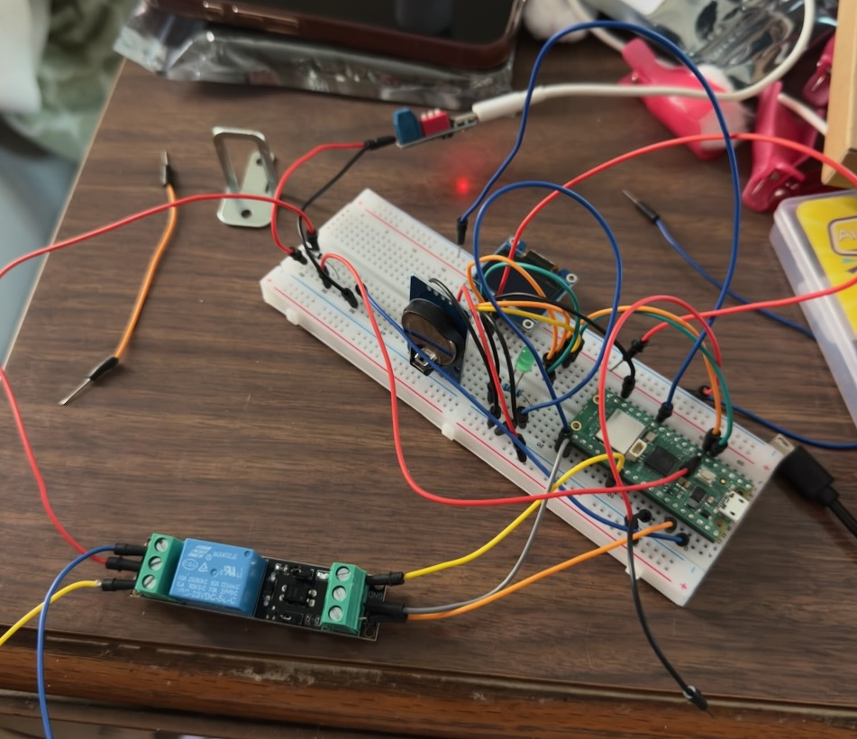
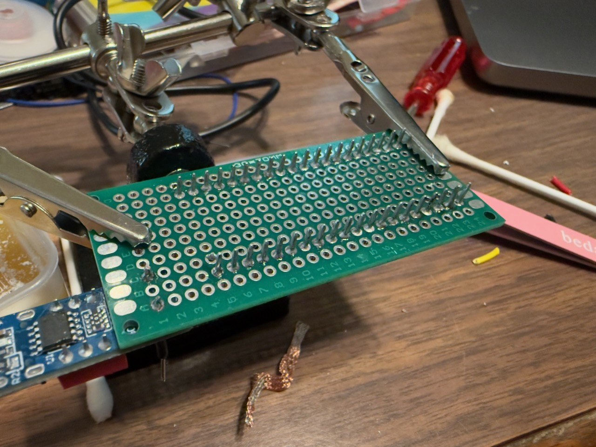
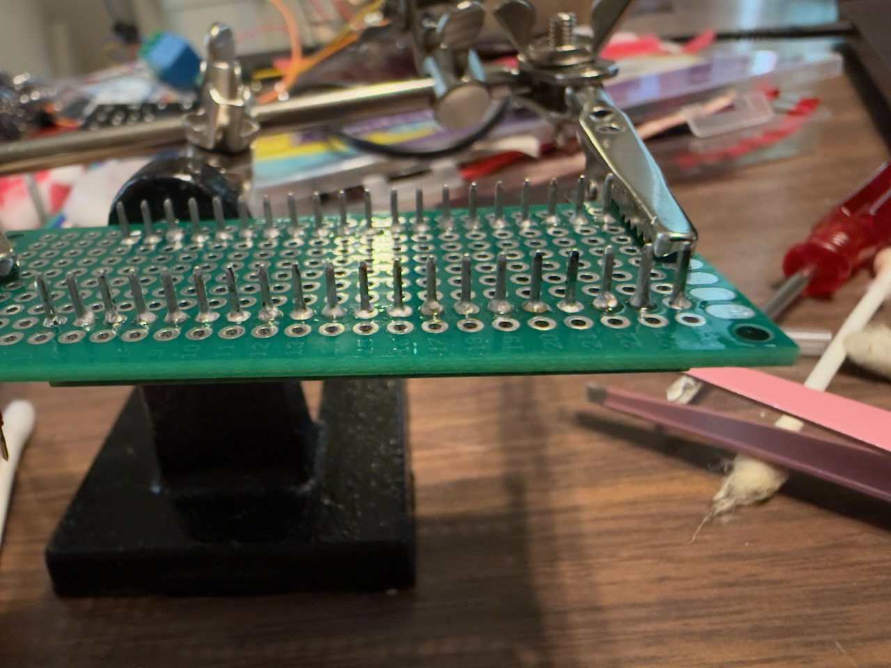
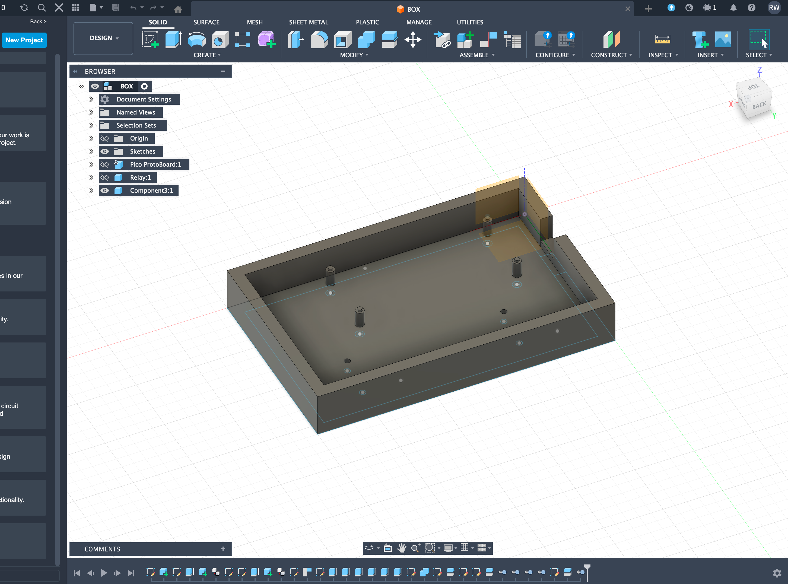
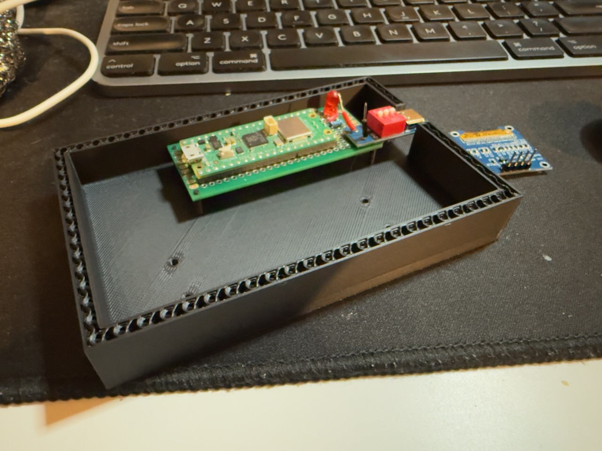
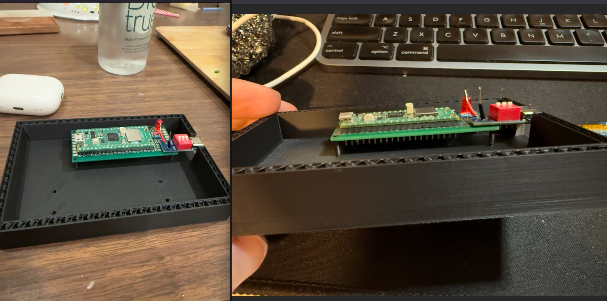
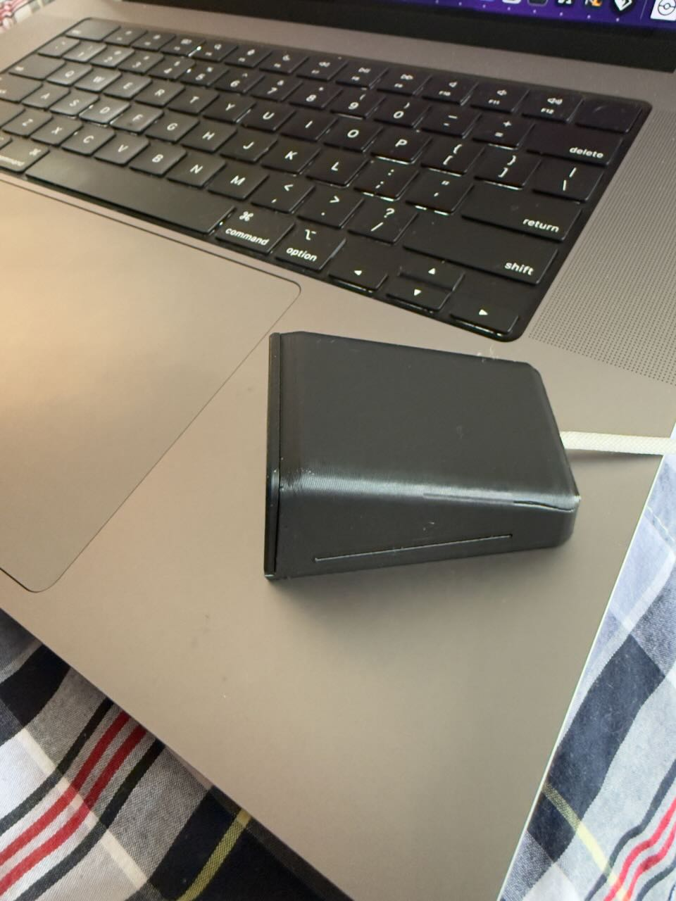

# Locked Box v1

I had 2 problems I wanted to solve, I'm trying to get healthier and nothing is more tempting to me than a snack before bed, not really the best when trying to lose weight. The second issue is that while. I've been a programmer for years now I had no understanding of lower languages and the actual machines that run what I create. Which lead me to this idea, how about I overengineer a solution for a non problem? My solution was to spend weeks building a box that physically won't open until 
the weekend.

Was buying a regular lock box an option? Yes. Did I consider it? Briefly.

## The Idea

The concept is simple. A box with an electronic lock that only opens on 
Saturday and Sunday. A Raspberry Pi Pico (The brains) reads the day from a DS3231 RTC module (a little clock chip with its own battery so it keeps time even unplugged), 
and if it's a weekend, it fires a relay that powers the lock open. A small OLED 
screen shows the time, the current state, and when it will open next.

The Pico is a microcontroller, think of it like a very small, very cheap computer 
that doesn't run a full operating system. It just runs one program, does its job, 
and that's it. No browser, no background apps. Just "is it the weekend? No? 
Stay locked." Perfect for this kind of thing.

Simple enough right? Right...

## What I Actually Built So Far

The first step was proving the concept on a breadboard. A breadboard is basically 
a reusable prototyping surface where you can plug components in and wire them 
together without soldering anything. Great for testing, looks absolutely like a bomb in any action movie, to anyone who hasn't seen one before.

{: style="width: 50%;"}{: .mx-auto.d-block :}

*The glamorous early stages. That bracket on the left is the actual lock.*

Getting everything clicking was honestly pretty satisfying. I wired up the Pico, 
relay, and 5V cabinet lock and got the lock clicking open from code. That moment 
felt great.



*Added the OLED screen to this iteration so I could see status without opening a serial monitor.*

Then I started soldering things to a prototype board, which is like a breadboard 
but permanent. You melt metal to connect everything instead of just plugging it in.

{: style="width: 50%;"}{: .mx-auto.d-block :}
{: style="width: 50%;"}{: .mx-auto.d-block :}

{: .box-note}
**Note:** *This is what it looks like before the chaos becomes organized chaos.*

And ran into my first real lesson about hardware: **power is not as simple as 
it looks.**

My USB-C trigger board outputs 5V, but after the flyback diode it drops to about 
4.75V. A diode is a little component that only lets electricity flow one direction, 
kind of like a one-way valve. This one protects the circuit from a voltage spike 
when the lock turns off, otherwise that spike can fry things upstream. 

I thought I could bump the input to 9V and use a resistor to step it back down 
to 5V. The resistor started smoking and caught on fire, it smellt terrible. So yeah, I'm taking power a bit more seriously now.

## The Enclosure

Once the electronics were mostly working I needed somewhere to put them. I 
designed the enclosure in Fusion 360, which is free 3D modeling software. 
I had never modeled anything before so this was its own whole learning curve.

{: .box-note}
**Note:** *The CAD model. Those little cylinders are mounts for the boards to sit on. 
Getting those positioned correctly required a lot of measuring*

The first few prints were... educational. The board didn't fit. Then it fit but the 
mounts were too fragile. Then the mounts were fine but I'd made the whole thing 
too small. Eventually it came together.

*First time the board actually seated correctly. Small win but I'll take it.*

*Getting those mount positions right took a few failed prints.*

## The Side Quest I Didn't Plan On

While waiting on parts I stumbled on a cool 3D printed enclosure designed for a 
tiny OLED screen. I also came across the XIAO ESP32C6, another small 
microcontroller board that has something the Pico doesn't: a built-in battery 
charging chip. That last part matters because I've been trying to figure out how 
to add battery backup without burning my house down.

So I built a little Wi-Fi clock with it just to learn. It connects to an NTP server, 
which is basically a server on the internet whose only job is to tell you the exact 
time, grabs the current time, and displays it on a tiny screen.

{: style="width: 50%;"}{: .mx-auto.d-block :}
*Looks surprisingly professional for something that took me a weekend of headaches.*

Also there's a pokeball bouncing around like an old DVD screensaver. 
Completely useless, but I learned a ton.

{: style="width: 50%;"}{: .mx-auto.d-block :}
*Worth every hour. I regret nothing.*

Specifically:
- How to convert bitmap images into something a tiny OLED can render
- Embedded debugging is brutal. Some errors just don't output anything because 
they're tied to IO pins
- Soldering for an enclosed space is its own special kind of frustrating

## Where It's At

Hardware side is mostly working. I have the Pico, relay, and lock on a prototype 
board and it fits in a printed enclosure. The weekend logic still needs to be 
implemented cleanly and I need to get everything into a final enclosure with a 
fuse and proper cable management.

Still undecided on whether to add a battery. I want to. I also want to keep my 
house.

I'll do a follow up post once this thing is actually done and I can put something 
in it. Probably snacks.

Have you done any hardware projects? I feel like this stuff doesn't get enough 
attention from the software crowd.